# Phase 1 Clean Protocol

Date: 2026-07-30

## Purpose and entry point

`src.phase1_clean` is the leakage-remediated E-GraphSAGE experiment path.
`src.run_experiments` remains the historical reproduction path and must not be
used for clean claims. The clean runner does not change the model architecture,
the feature implementation, or the closed-set classification task.

The policy source is `config.yaml:phase1_clean`:

- output root: `artifacts/phase1_clean`;
- canonical cleaned-data cache: `artifacts/data_cache`;
- final imbalance mode: `class_weight`;
- seeds: `42`, `1337`, and `2026`;
- fixed external eight-class taxonomy.

## Pooled and per-scenario protocol

```mermaid
flowchart LR
  A["Raw rows + stable row IDs"] --> B["Deterministic train / validation / test membership"]
  B --> C["Fit preprocessor on train raw rows only"]
  C --> D["Transform all rows with frozen preprocessor"]
  D --> E["Build full graph and reattach membership masks"]
  E --> F["Class weights from train labels only"]
  F --> G["Gradient on train_mask"]
  G --> H["Early stopping on val_mask"]
  H --> I["One final evaluation on test_mask"]
```



The graph is deliberately transductive: validation/test edge features and
topology may participate in full-graph message passing. Their labels do not fit
the preprocessor, determine class weights, enter gradient loss, or select the
imbalance mode. This limitation must accompany any pooled result.

Stable row IDs are SHA-256 values over protocol version, scenario name, and raw
row position. The runner resolves masks from these IDs after transformation
rather than assuming that intermediate DataFrame order is unchanged.

`per_scenario` uses the same boundary independently for each scenario.

## Canonical cleaned-data cache

The clean runner parses every scenario once at process start, before pooled or
LOSO preparation. It stores the deterministic, pre-split result at:

```text
artifacts/data_cache/<scenario>/<fingerprint>.parquet
```

The fingerprint covers raw file size, raw `mtime_ns`, the parser/cleaning code
digest, and the canonical schema contract. A raw-file, parser, cleaning-rule,
or schema change therefore creates a different immutable cache path. A
fingerprint lock serializes concurrent builders: if several seed processes
start together, one builds while the others wait and then read the completed
cache.

Allowed cache fields are parsed raw columns retained by `clean_flows`,
deterministically cleaned values, canonical detailed labels, source/destination
identifiers, missing indicators, and stable row IDs. It never contains split
membership, masks, scaler values, learned category vocabulary, class weights,
undersampling output, transformed features, graph tensors, or model state.
`cap_per_class` is applied while reading the canonical cache, so pilot and full
caps share the same parsed data version.

Split-before-fit remains unchanged: each protocol/seed derives its membership
from stable IDs, then fits the preprocessor on training rows only.

### Raw-open trace

Before this cache, the capped loader opened each scenario twice per clean
process (header scan plus pandas parse), and each seed repeated that work. The
old verifier opened each raw file three times and did not warm the runner.

With the canonical path:

| Operation for one scenario/version | Raw opens | Raw parse/clean passes |
|---|---:|---:|
| Verifier or clean runner, first cache MISS | 1 | 1 |
| Pooled plus every LOSO fold in that process | 0 additional | 0 additional |
| Pilot/full/different seed after cache exists | 0 | 0 |
| `--no-cache`, per process | 1 | 1 |
| `--rebuild-cache`, per invocation | 1 | 1 |

Thus, in the intended sequence `verifier -> pilot -> seeds 42/1337/2026`, the
verifier performs the sole raw parse and every training process is a HIT.
Parquet reads still occur per process; raw parsing does not.

## LOSO protocol


The held-out scenario is excluded from preprocessing fit, class-weight
calculation, undersampling, training, and model selection. Validation labels
are excluded from gradient loss. The non-held-out graphs remain transductive
within the training domain, so validation edge features and topology can be
visible during message passing; this is an accepted protocol limitation.

## Taxonomy and imbalance policy

The fixed mapping is declared before any split in `config.yaml:phase1_clean`
and enforced against the `FIXED_LABELS` constant in `src/phase1_clean.py`:

| Index | Label |
|---:|---|
| 0 | Attack |
| 1 | Benign |
| 2 | C&C |
| 3 | C&C-HeartBeat |
| 4 | DDoS |
| 5 | Okiru |
| 6 | Okiru-Attack |
| 7 | PartOfAHorizontalPortScan |

A class with zero training support retains its output index, receives class
weight `0`, and is recorded with support `0`. This preserves the deployment
contract; it does not claim that the model learned that class.

`class_weight` is selected in config before the run. The clean runner does not
inspect pooled test or LOSO held-out scores to select a mode. The optional
undersampling helper is retained only for regression coverage and may remove
training rows only.

## Preprocessing and final-test isolation

Scaler statistics, categorical vocabularies, rare-service grouping, feature
columns, and class weights are learned only from training membership.
Validation is used once per epoch for early stopping. The best validation
checkpoint is restored before exactly one final test/held-out evaluation.

Metrics from the historical `none`, `class_weight`, and `undersample` Phase A
runs remain historical comparisons. They are not selection evidence for the
clean rerun.

## Run-scoped artifact contract

Every new run directory contains:

```text
model.pt
preprocessor.pkl
schema.json
labels.json
metadata.json
metrics.json
split_manifest.json
predictions.csv
```

The checkpoint embeds model config, feature dimension, exact ordered feature
columns, fixed label mapping, seed, protocol, bundle version, and schema
digests. `schema.json` and `labels.json` carry their own canonical digests.
`split_manifest.json` records per-scenario split counts and stable-ID digests
plus disjointness and coverage checks. `metadata.json` records protocol,
support/counts, best epoch, validation/final metrics, git state, timestamp, and
known limitations.

`predictions.csv` contains one row per final test/held-out example: stable row
ID, scenario, split, protocol, seed, true/predicted label and index, confidence,
entropy, true-class training support, the zero-support flag, and logits plus
probabilities in fixed taxonomy order. These rows are captured during the
existing single final forward pass; prediction export does not add another
evaluation or alter training behavior.

`validate_clean_bundle()` checks these files and then calls the existing Phase
3 fail-closed loader. Feature-order, feature-count, or label-mapping drift is
rejected. Clean bundles must not be written under
`artifacts/phase1_results/`.

## Commands

Verify all six required raw scenarios and write
`dataset_manifest.json`/`dataset_manifest.csv`:

```bash
python scripts/verify_phase1_dataset.py \
  --config config.yaml \
  --out-dir artifacts/phase1_clean \
  --cache-dir artifacts/data_cache
```

The verifier builds or reuses the same canonical cache used by training. Its
summary reports cache HIT/MISS and raw-open count. The `sha256` manifest field
is the canonical fingerprint digest, deliberately based on raw stat identity
instead of rereading a 13 GB dataset solely to hash every byte.

The verifier accepts the same explicit scenario format as the clean runner:

```bash
python scripts/verify_phase1_dataset.py \
  --scenarios \
    1-1=/path/to/1-1/conn.log.labeled \
    3-1=/path/to/3-1/conn.log.labeled \
    9-1=/path/to/9-1/conn.log.labeled \
    34-1=/path/to/34-1/conn.log.labeled \
    36-1=/path/to/36-1/conn.log.labeled \
    39-1=/path/to/39-1/conn.log.labeled
```

Toy pooled + one-fold LOSO smoke, one epoch each, temporary bundles only:

```bash
python -m src.phase1_clean --config config.yaml --toy-smoke
```

One-seed local dry run with the two scenario files currently present:

```bash
python -m src.phase1_clean \
  --config config.yaml \
  --protocols pooled loso \
  --scenarios \
    34-1=data/CTU-IoT-Malware-Capture-34-1/conn.log.labeled \
    3-1=data/CTU-IoT-Malware-Capture-3-1/conn.log.labeled \
  --seed 42 \
  --epochs 1 \
  --cap-per-class 100 \
  --out-dir artifacts/phase1_clean/dry-run-seed-42
```

Three-seed clean rerun on Vast.ai, after all six configured raw files exist:

```bash
for seed in 42 1337 2026; do
  python -m src.phase1_clean \
    --config config.yaml \
    --protocols pooled loso \
    --seed "$seed" \
    --out-dir "artifacts/phase1_clean/seed-$seed"
done
```

The default is cache enabled. Useful controls are:

```text
--cache-dir PATH
--rebuild-cache
--cache-format parquet
--no-cache
```

Do not use `--rebuild-cache` for every seed. Use it only after intentionally
changing parser/cleaning code or when diagnosing a damaged cache.

### Observed cache benchmark

No model training was involved. On the local Mac, with pandas parsing and
PyArrow 25 Parquet I/O:

| Dataset | Parsed rows | MISS | HIT | Raw opens MISS/HIT |
|---|---:|---:|---:|---:|
| Toy Zeek fixture | 720 | 0.264 s | 0.021 s | 1 / 0 |
| Real IoT-23 `34-1` (2.8 MiB) | 23,145 | ~0.34 s | ~0.01 s | 1 / 0 |

The large `39-1` speedup depends on disk and Parquet compression, but its raw
file is no longer reparsed by every fold or seed. Progress logs report scenario,
bytes, rows, elapsed time, HIT/MISS, rows/s, MiB/s, and raw-open count.
For capped reads, the HIT path scans the label column by Parquet row group and
loads full columns only for rows needed by the cap.

Analyze all completed seed roots:

```bash
python scripts/analyze_phase1_clean.py \
  artifacts/phase1_clean/seed-* \
  --output-dir artifacts/phase1_clean/analysis
```

The analyzer writes `summary.csv`, pooled/LOSO summaries, class support,
binary metrics, `report.md`, confusion figures when predictions are present,
and `entropy_summary.csv` only when a complete fixed-order probability or
logit artifact exists. Missing artifacts are reported as `NOT_AVAILABLE`; no
metric is reconstructed by assumption.

Each output root must be new or contain no colliding run directories. Do not
point `--out-dir` at `artifacts/phase1_results`.
