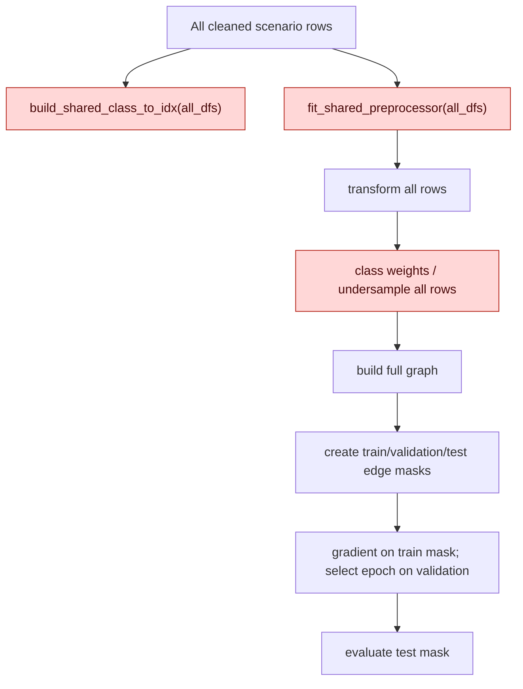
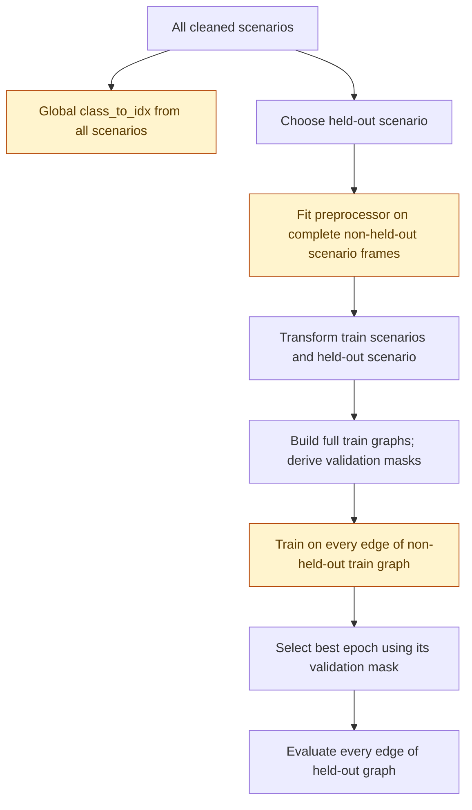

# Preprocessing Audit

Date: 2026-07-30

## Executive conclusion

**FAIL: Phase 1's current/historical `run_all()` path has real
train/validation/test leakage in `pooled` and `per_scenario`.** It fits the
shared preprocessor, creates the label mapping, computes class weights, and can
undersample before those protocols create edge masks. This is not merely the
intended transductive graph exposure.

`LOSO` excludes the held-out scenario from the scaler and categorical fit, but
it still (a) exposes held-out labels through the global label vocabulary, (b)
uses validation rows of the non-held-out scenarios in fit/weighting, and (c)
trains on those validation rows before selecting the best epoch. Therefore it
does not meet a strict train-only preprocessing/validation protocol either.

The Phase 1 result files are retained as **historical benchmark evidence**, not
as leakage-free measurements for the rerun. No model or experiment behavior was
changed by this audit: correcting the protocol changes reported measurements
and needs a deliberate implementation/review before retraining.

Evidence labels in this document mean:

- **Verified from code:** current source and the committed historical source.
- **Verified from artifact:** object/metadata loaded from the listed file.
- **Unknown:** provenance cannot be reconstructed from available metadata.

## Data-flow diagrams

### Pooled and per-scenario: current/historical path



`run_all()` creates B/C before it dispatches either protocol
(`src/run_experiments.py:1252-1280`). `run_pooled()` only creates masks after
the full graphs and optional imbalance transformations exist
(`src/run_experiments.py:673-709`). `run_per_scenario()` follows the same order:
transform/undersample and class-weight computation precede `train_model()`,
which creates its masks later (`src/run_experiments.py:514-545`,
`src/train.py:595-605`).

### LOSO: current path



The held-out rows do not reach `fit_shared_preprocessor`, but the validation
rows inside the non-held-out scenario frames do. The loss is taken over every
edge in those graphs, not `~val_mask` (`src/multi_scenario.py:647-691`,
`src/multi_scenario.py:804-834`).

## Audit table

| Invariant | Status | Evidence: file + function + line | Impact | Required action |
|---|---|---|---|---|
| Scaler fit train-only | **FAIL** for pooled/per-scenario; **WARN** LOSO | `run_all`, `src/run_experiments.py:1255-1280` passes all rows into `fit_shared_preprocessor`; `fit_preprocessor`, `src/preprocess.py:503-506` fits `StandardScaler`. LOSO passes whole non-held-out scenario frames at `src/multi_scenario.py:647-650`, before validation split at `690-691`. | Validation/test statistics influence scaling in pooled/per-scenario; validation statistics influence LOSO. | Generate row masks before fitting; concatenate only train rows for each protocol/LOSO round. |
| Categorical vocabulary train-only | **FAIL** for pooled/per-scenario; **WARN** LOSO | `fit_preprocessor` derives proto/service/conn-state categories and rare-service threshold from its input at `src/preprocess.py:475-500`; caller inputs above are not train-only. | Test/validation categories determine encoded columns and rare grouping. | Same split-before-fit change. |
| Feature order frozen after fit | **PASS** as a helper contract; **FAIL** as pooled/per-scenario provenance | `fit_preprocessor` freezes `feature_columns` at `src/preprocess.py:515-560`; `transform` reconstructs and validates exactly that order at `661-677`. But the fitted columns came from all rows in pooled/per-scenario. | Order is deterministic, but its learned schema leaks split membership. | Refit from train rows; persist the exact fitted schema beside its checkpoint. |
| Class weights train-only | **FAIL** pooled/per-scenario; **WARN** LOSO | Pooled gathers every transformed row before masks at `src/run_experiments.py:673-678`. Per-scenario does likewise at `532-539`. LOSO excludes held-out but gathers every edge of non-held-out full graphs at `src/multi_scenario.py:725-740`. | Label frequencies from validation/test affect loss weighting. | Compute weights only from training-mask labels. |
| Undersampling train-only | **FAIL** pooled/per-scenario; **WARN** LOSO | Pooled calls `_maybe_undersample` before masks at `src/run_experiments.py:680-709`; per-scenario at `514-545`. LOSO undersamples complete non-held-out frames at `693-713`, after validation masks exist but without using them. | Validation/test distribution may be removed/changed before evaluation; LOSO validation is included in train graph. | Sample only training rows; preserve all validation/test rows and their masks. |
| Validation not used in gradient updates | **PASS** pooled/per-scenario loss masking; **FAIL** LOSO | Pooled loss indexes `g.train_mask` at `src/run_experiments.py:745-752`; `train_model` does the same at `src/train.py:646-653`. LOSO calls `criterion(logits, g.edge_label)` for all edges at `src/multi_scenario.py:804-816`. | LOSO early-stop validation is trained on, invalidating model selection. | Make a training mask in each LOSO train graph and compute loss only on it. |
| Test not used for model selection | **FAIL** | `run_phase_a` selects `winning_mode` from each protocol's reported `macro_f1` at `src/run_experiments.py:1048-1084`; those values are test/held-out evaluations. Phase B then uses that choice (`1350-1384`). | Imbalance mode is selected using test information; Phase B is optimistic. | Freeze mode before final test, or select it only with validation metrics/nested validation. |
| Held-out scenario excluded from LOSO preprocessor fit | **PASS** for scaler/categories/schema | `train_names = scenario_names - held_out` and only those frames are passed to `fit_shared_preprocessor` at `src/multi_scenario.py:636-650`; held-out is transformed only at `682-688`. | No held-out flow features are fit into scaler/categories. | Keep this boundary when splitting non-held-out frames into train/validation. |
| Held-out label vocabulary excluded | **FAIL** under strict inductive evaluation | `build_shared_class_to_idx(all_dfs)` is called before each LOSO loop at `src/multi_scenario.py:615-619`; its implementation unions all scenarios at `283-305`. | The output label schema reveals which classes are present in held-out. No held-out label enters loss because its class weight becomes zero, but this is still label-schema exposure. | Choose and document policy: training-only labels with explicit unknown-label evaluation, or a fixed external taxonomy declared before the split. |
| Unseen categorical values are deterministic | **PASS with caveat** | `transform` uses frozen feature columns. Unknown proto/conn-state map to all-zero known one-hots; unknown/rare service maps to `service_other` (`src/preprocess.py:617-655`). Toy probe verified this behavior. | No fit-time leakage; proto/conn-state unknowns are conflated with no known category rather than represented by a dedicated unknown bit. | No blocking fix for rerun; document this encoding choice or add explicit unknown buckets in a separately approved feature change. |
| Pooled graph protocol is reproducible | **PASS with caveat** | Deterministic seed/mask construction is in `src/train.py:251-339`; the config fixes seed 42 (`config.yaml:93-94`). | Split is reproducible on the same stack, but only one seed was reported and PyG GPU scatter is not strict deterministic. | Run three seeds after protocol fixes; record seed and split digest per run. |
| Checkpoint/preprocessor compatibility | **FAIL** for historical deployment bundle | Historical pooled checkpoint has `feature_dim=55` and no `feature_columns`; current `preprocessor.pkl` has 53 columns (verified artifact). Runtime rejects missing fields/mismatch in `src/core/legacy_bundle.py`. | The historical single-head inference bundle cannot be safely loaded. | Export a single run-scoped bundle with exact preprocessor, ordered schema, label mapping and digests. |

## Pooled protocol classification

**Classification: transductive edge-mask evaluation.** Each scenario graph is
built from all of its rows, then train/validation/test masks are attached
(`src/run_experiments.py:680-709`). During the forward pass the model receives
the full graph. In particular, E-GraphSAGE message passing uses `edge_index_mp`
and `edge_attr_mp` built from all original and reverse edges
(`src/graph_build.py:175-194`); training loss is restricted to train-mask
labels (`src/run_experiments.py:745-752`).

Therefore:

- **Test labels are not directly used in the pooled gradient.**
- **Test edge features and graph structure are visible during training-time
  message passing.** This is the declared transductive protocol, not by itself
  a label leak.
- **The current pooled result still has real leakage beyond transduction:** test
  rows are used to fit preprocessing, compute class weights, and possibly
  undersample before masks exist. In addition, the test macro-F1 selects Phase
  A's imbalance mode.

The historical pooled macro-F1 must consequently be described as a historical
transductive benchmark, not a clean train-only-preprocessing estimate.

## LOSO protocol classification

**Classification: scenario-held-out / inductive with qualifications.** The
held-out scenario's flow values do not fit the scaler, category vocabulary,
rare-service grouping, or feature order. It is transformed after a preprocessor
is fitted from non-held-out scenarios (`src/multi_scenario.py:647-688`).

However, it is not a fully clean strict inductive protocol:

- `class_to_idx` is created from all scenarios, including the held-out one.
- The non-held-out validation rows are included in preprocessing and class
  weighting, then used in the training loss.
- `run_phase_a` uses held-out macro-F1 to choose the imbalance mode consumed by
  Phase B.

The held-out test itself is not included in the epoch-loss loop, and is only
forwarded at final evaluation (`src/multi_scenario.py:878-904`).

## Artifact compatibility

### Verified artifacts

| Artifact | Verified contents | Compatibility/provenance result |
|---|---|---|
| `artifacts/phase1_results/checkpoints/pooled_egraphsage_class_weight_seed42.pt` | Modified 2026-07-04; `feature_dim=55`, 8-class `class_to_idx`, seed/protocol in `history_meta`; no `feature_columns`. | Legacy checkpoint. It cannot prove exact column names/order or pair with the current preprocessor. |
| `artifacts/phase1_results/checkpoints/egraphsage_class_weight_seed42.pt` | Modified 2026-07-04; `feature_dim=53`, 5-class mapping; no `feature_columns`; history contains seed and split ratios. | Also lacks feature schema/preprocessor version and run digest. |
| `artifacts/phase1_results/checkpoints/preprocessor.pkl` | Modified 2026-07-29; `Preprocessor`, 53 `feature_columns`, scaler input dimension 8, categories `proto=3`, `service=2`, `conn_state=12`. | Not compatible with the pooled 55-feature checkpoint. Its source rows, split, seed and generating run are **UNKNOWN**. |

Historical commit `9e87852` (“result phase 1”) generated the result/checkpoint
files but its `save_checkpoint` did not write `feature_columns`
(`git show 9e87852:src/train.py`, `466-491`), and its `run_all()` did not save a
preprocessor (`git show 9e87852:src/run_experiments.py`, `1251-1280`). The
current source later added checkpoint feature columns and an unversioned
`preprocessor.pkl` write (`src/train.py:466-499`,
`src/run_experiments.py:1275-1276`), but no run-scoped manifest/digest links
the file now present to the historical pooled checkpoint.

The Phase 3 loader correctly fails closed: it demands ordered feature columns,
checks their length and exact equality with the preprocessor, and refuses
position-blind padding (`src/core/legacy_bundle.py`).

## Automated protection present today

- `tests/phase1/test_preprocessing_contract.py` (added by this audit) verifies
  the reusable helper learns scaler/categories only from its explicit input,
  freezes the feature order, handles unseen categories deterministically, and
  keeps imbalance helpers confined to their explicit input.
- `scripts/test_safe_split.py` verifies deterministic/disjoint masks and the
  singleton fallback.
- `tests/phase3/test_model_contract.py` verifies current checkpoint exports
  include feature columns and the inference loader rejects legacy/mismatched
  artifacts.

These tests do **not** make the current Phase 1 orchestrator safe: there is no
end-to-end regression test requiring `run_all()` to split before fit/weighting/
undersampling, nor one requiring the LOSO loss to exclude validation edges.

## Validation performed

- Ran the new helper-level regression suite:
  `python -m unittest discover -s tests/phase1 -v` — 2 passed.
- Ran `python scripts/test_safe_split.py` — 4 focused split checks passed.
- Ran `python -m unittest discover -s tests/phase3 -v` — 8 contract/API tests
  passed.
- Ran a temporary two-scenario, one-epoch pooled and LOSO smoke without writing
  repository artifacts. Both returned finite metrics (`pooled`: 1 row; `LOSO`:
  3 rows including mean). This proves the paths execute; it does not alter the
  leakage verdict because the smoke intentionally exercised the current code.
- Inspected historical checkpoint/preprocessor objects directly with
  `torch.load(..., weights_only=False)` and `pickle.load`.

## Minimal fixes before retraining

These are required corrections, but were not implemented during this audit
because they alter the Phase 1 experiment protocol and historical metrics.

1. **Split before every learned preprocessing step.** For pooled and
   per-scenario, create deterministic row/edge split membership first, fit the
   preprocessor on only training rows, and transform all rows with that frozen
   object. For LOSO, first divide each non-held-out scenario into train and
   validation rows, then fit only on their combined train rows.
2. **Restrict imbalance operations to training rows.** Compute class weights
   from train labels only. Undersample only train rows; retain every
   validation/test row unchanged. Build/retain the intended transductive graph
   without letting non-train labels choose which edges survive.
3. **Mask the LOSO loss.** Use only non-validation edges for each non-held-out
   train graph; use validation only for early stopping.
4. **Stop selecting hyperparameters on test/held-out scores.** Freeze a
   documented imbalance mode before final test, or select it from validation
   metrics only. Treat model comparison similarly if a single final winner will
   be claimed.
5. **Choose a label-vocabulary policy.** Either use a taxonomy fixed before
   the split, or derive it from train labels and score labels unseen in train as
   unsupported/unknown. Do not silently union held-out labels.
6. **Write a run-scoped bundle.** Store the exact preprocessor, ordered feature
   schema/digest, label mapping/digest, seed, protocol, split counts/digest,
   raw-data fingerprint and checkpoint in one immutable run directory.
7. **Add runner-level regressions after the fix.** A sentinel category/label in
   validation/test/held-out data must not alter the fitted preprocessor, class
   weights or undersampling decision; a LOSO validation sentinel must never be
   indexed by training loss.

Phase 2 preparation is a useful reference for the first correction: it builds
masks before concatenating train rows for `fit_preprocessor`
(`src/federated/data/preparation.py:175-201`). Phase 1 does not currently reuse
that preparation path.

## Retraining readiness checklist

| Requirement for a 3-seed E-GraphSAGE rerun | Status | Evidence / next step |
|---|---|---|
| Leakage-free Phase 1 pooled/per-scenario runner | **NO** | Must implement items 1–4 above. |
| LOSO validation excluded from fitting and loss | **NO** | Must implement items 1–3 above. |
| Fixed label-vocabulary policy | **NO** | A documented design decision is required. |
| Run-scoped model/preprocessor/schema bundle | **NO** | Historical artifact pair is incompatible; implement item 6. |
| Regression proof for runner-level invariants | **NO** | Add item 7 after the runner fix. |
| Six raw IoT-23 scenarios available locally | **NO** | Only `3-1` and `34-1` are present in `data/`; `1-1`, `9-1`, `36-1`, `39-1` are absent. |
| PyG available for Phase 1 | **YES** | Local environment reports `torch_geometric 2.8.0`. |
| Three explicit seeds selected | **NO** | Historical results only recorded seed 42; record three seeds after protocol fix. |

Do not run the full GPU retrain yet. After the listed code/protocol fixes are
reviewed and their runner-level tests pass, the intended command is:

```bash
bash scripts/run_full_gpu.sh --config config.yaml --no-git
```

For a direct three-seed invocation, use a distinct output directory for each
seed and never resume into historical `artifacts/phase1_results`:

```bash
python -m src.run_experiments --config config.yaml --seed 42 --out-dir artifacts/phase1_clean/seed-42
python -m src.run_experiments --config config.yaml --seed 1337 --out-dir artifacts/phase1_clean/seed-1337
python -m src.run_experiments --config config.yaml --seed 2026 --out-dir artifacts/phase1_clean/seed-2026
```

Those commands are intentionally contingent on the checklist becoming YES; in
the current state they would reproduce the leakage described above.

## Remediation status

Date updated: 2026-07-30

The original audit above remains the verdict for the historical
`src.run_experiments` / `src.multi_scenario` path and its results. Remediation
is implemented in the separate `src.phase1_clean` path so the historical
artifacts and reproduction behavior remain untouched.

| Original FAIL/WARN | Status in clean runner | Evidence |
|---|---|---|
| Pooled/per-scenario scaler and categorical fit used all rows | **FIXED** | `make_transductive_split_plans()` establishes stable raw-row membership before `prepare_transductive_clean()` calls `_fit_from_train_rows()`. |
| Pooled/per-scenario class weights used all rows | **FIXED** | `prepare_transductive_clean()` selects only each plan's `train_ids` before `fixed_class_weights()`. |
| Undersampling could alter validation/test | **FIXED for supported optional path** | `_undersample_training_membership()` samples only `train_ids`, preserves validation/test IDs, and asserts membership coverage. The final rerun mode remains `class_weight`. |
| LOSO preprocessor included non-held-out validation rows | **FIXED** | `prepare_loso_clean()` creates `_train_val_plan()` for every non-held-out scenario and fits on the union of only their train IDs. |
| LOSO validation labels entered gradient loss | **FIXED** | `train_prepared_clean()` indexes loss with each graph's `train_mask`; validation is evaluated separately for best-epoch selection. |
| Held-out labels influenced LOSO vocabulary | **FIXED** | `fixed_class_to_idx()` enforces the externally declared eight-class list in `config.yaml:phase1_clean`; it does not derive indices from any DataFrame. |
| Phase A test/held-out scores selected imbalance mode | **FIXED in clean runner** | `resolve_clean_imbalance_mode()` accepts only preselected `class_weight`; the clean runner never calls historical winning-mode logic. |
| Historical checkpoint and preprocessor are incompatible | **FIXED for new clean runs; historical bundle remains invalid** | `write_clean_bundle()` writes a run-scoped bundle including per-sample final predictions, and `validate_clean_bundle()` verifies schema/label digests and the Phase 3 runtime contract. |
| Full-graph pooled message passing exposes validation/test features/topology | **ACCEPTED PROTOCOL LIMITATION** | Pooled remains the explicitly requested transductive edge-mask protocol. Labels remain isolated by masks. |
| LOSO non-held-out validation features/topology remain visible in training-domain graphs | **ACCEPTED PROTOCOL LIMITATION** | The LOSO loss excludes validation labels, but non-held-out graphs retain full-domain message passing as documented in `docs/PHASE1_CLEAN_PROTOCOL.md`. |
| Explicit unknown buckets for proto/conn-state | **DEFERRED** | Frozen transform remains deterministic; changing the feature design is outside this minimal protocol correction. |
| Full six-scenario, three-seed measurements | **DEFERRED** | No full IoT-23 training was authorized. Four configured raw files are still absent locally. |

Runner-level regression evidence is in
`tests/phase1/test_clean_protocol.py`: numeric and categorical sentinels,
train-only class weights/undersampling, held-out isolation, loss masking,
preselected mode, and fail-closed bundle compatibility. The executable protocol
and exact clean commands are documented in `docs/PHASE1_CLEAN_PROTOCOL.md`.

### Clean-rerun readiness

| Requirement | Status |
|---|---|
| Leakage-remediated pooled/per-scenario runner | **YES** |
| LOSO train-only preprocessing and validation-masked loss | **YES** |
| Fixed eight-class taxonomy | **YES** |
| Preselected `class_weight`, independent of final test | **YES** |
| Run-scoped Phase 3-compatible bundle | **YES** |
| Eight required runner-level regressions | **YES** |
| Toy pooled + LOSO artifact smoke | **YES** |
| Six raw scenarios locally available | **NO — only 34-1 and 3-1 are present** |
| Full three-seed GPU rerun completed | **NO — intentionally not run** |

The historical commands shown immediately above this section remain historical
and must not be used for a clean claim. Use the `src.phase1_clean` commands in
`docs/PHASE1_CLEAN_PROTOCOL.md`.
