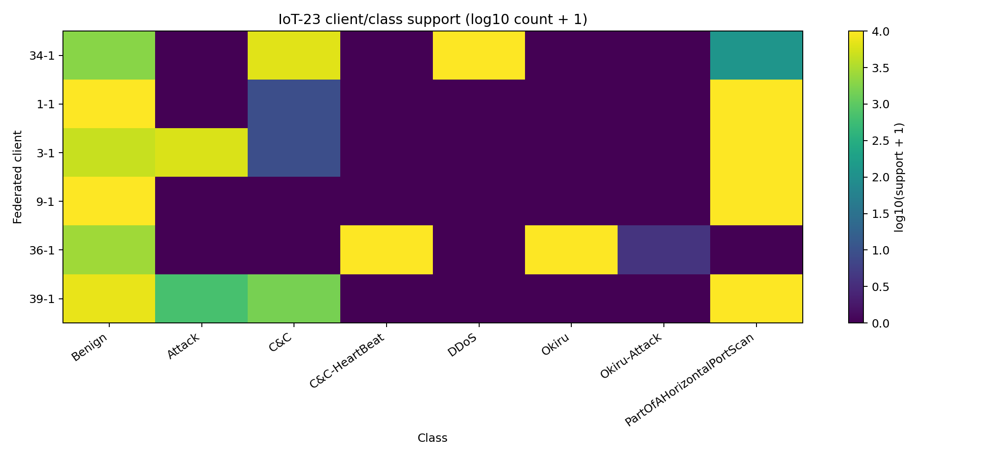
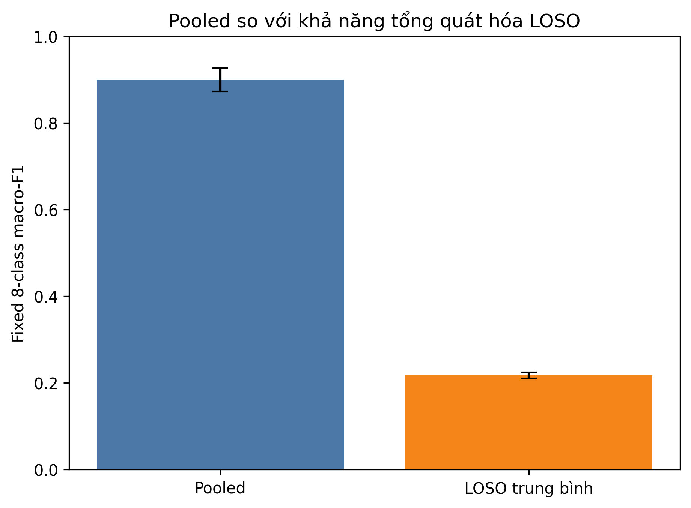
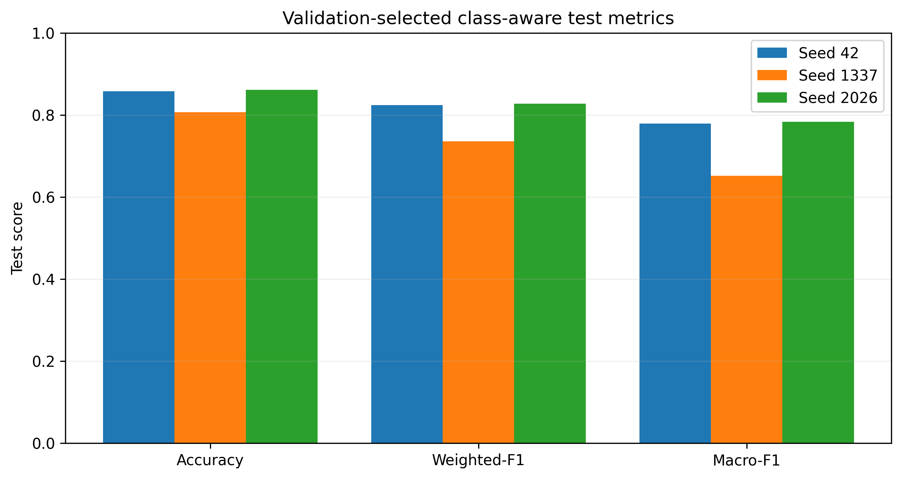
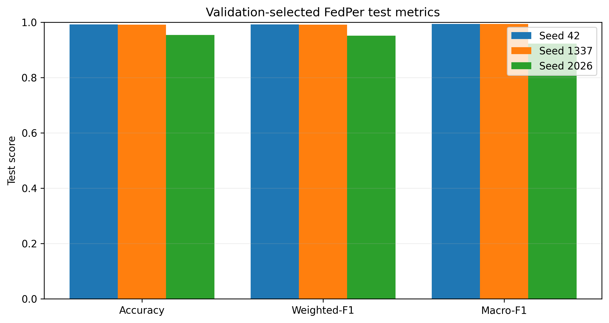
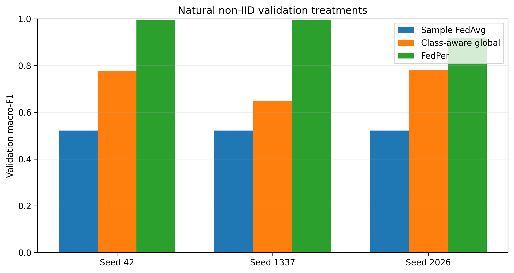
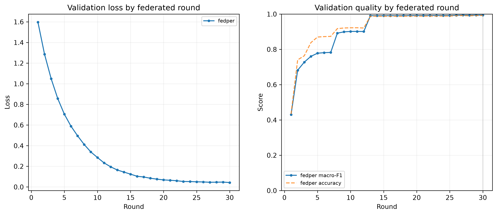
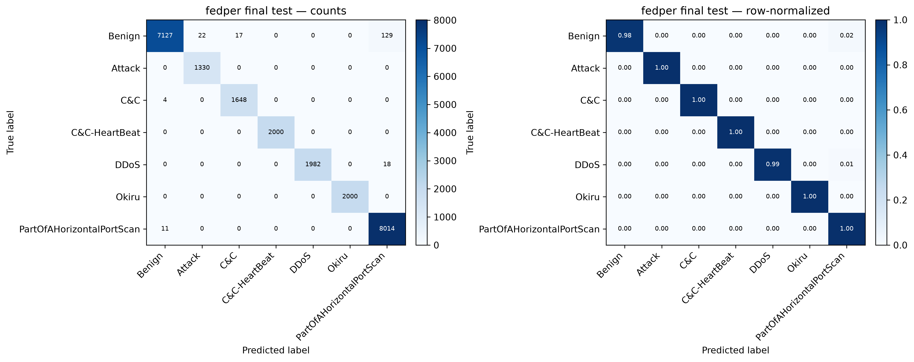

# Mục lục {.unnumbered}

1. Tóm tắt điều hành
2. Phạm vi và câu hỏi nghiên cứu
3. Kiến trúc hệ thống
4. Dữ liệu, preprocessing và graph protocol
5. Phương pháp thực nghiệm
6. Kết quả
7. Kết quả GKE end-to-end
8. Đánh giá overfitting
9. Duplicate leakage và novel-only evaluation
10. Đánh giá CI/CD, GitOps và observability
11. Privacy và security interpretation
12. Threats to validity và giới hạn
13. Khuyến nghị tiếp theo
14. Kết luận
15. Phụ lục và khả năng tái lập

# Tóm tắt điều hành

Báo cáo này đánh giá một pipeline Federated Learning (FL) cho phân loại flow
mạng IoT-23 bằng E-GraphSAGE trên sáu Edge clients. Mục tiêu không chỉ là đạt
metric cao mà còn xác định vì sao mô hình liên kết thất bại hoặc thành công,
kiểm tra khả năng tái lập và chứng minh luồng triển khai GitOps trên GKE.

Kết quả controlled experiment cho thấy mã nguồn và FedAvg cơ bản hoạt động:
trên cùng bài toán bảy class, stratified-IID FedAvg đạt test macro-F1
`0,988879`, gần centralized `0,986555`, trong khi natural scenario non-IID chỉ
đạt `0,507170`. Vì vậy nguyên nhân chính không phải lỗi runtime mà là xung đột
giữa các client có class riêng. Class-aware aggregation cải thiện trung bình
lên `0,738097 ± 0,060893`, nhưng vẫn không giữ được C&C-HeartBeat trong global
head. FedPer giải quyết trực tiếp xung đột này bằng cách chia model thành shared
GraphSAGE encoder và private classifier head; ba seed đạt test macro-F1
`0,970459 ± 0,033444`.

Lần chạy GKE seed 42 hoàn tất 30 round × 5 local epoch với 6/6 client, không có
failure, đạt test macro-F1 `0,994073`. Train, validation và test gần nhau, nên
không có bằng chứng overfitting cổ điển trên split hiện tại. Tuy nhiên 21,65%
test rows có bản sao nội dung chính xác trong train. Riêng DDoS có 1.996/2.000
test rows đã xuất hiện trong train; novel-only chỉ còn bốn mẫu và F1 là `0,4`.
Do đó kết quả 0,994 chứng minh hiệu quả personalized trên known Edge trong
protocol transductive, nhưng chưa chứng minh khả năng tổng quát hóa DDoS hoặc
Edge hoàn toàn mới.

# Phạm vi và câu hỏi nghiên cứu

Báo cáo trả lời năm câu hỏi:

1. Pipeline dữ liệu và E-GraphSAGE có tạo được centralized upper bound hợp lý?
2. FedAvg thấp vì bug triển khai hay vì natural non-IID?
3. Reweighting/class-aware aggregation có khôi phục các private class không?
4. FedPer có cải thiện ổn định và chạy được end-to-end trên GKE không?
5. Metric cuối có dấu hiệu overfitting hoặc leakage làm suy yếu kết luận không?

Hai không gian nhãn được báo cáo riêng:

- benchmark tám class giữ Okiru-Attack với tổng cộng ba mẫu;
- benchmark bảy class loại đúng class siêu hiếm này để làm controlled
  experiment, không thay đổi sáu scenario còn lại.

Không so sánh trực tiếp metric tám class và bảy class như thể chúng là cùng một
bài toán.

# Kiến trúc hệ thống

```text
Developer / pull request
        |
        +--> GitHub Actions: test, lint, scan, Helm/Terraform validation
        |
        `--> merge main --> GitHub webhook --> Jenkins VM
                                                  |
                                                  +--> build/test/scan image
                                                  +--> push Docker Hub
                                                  `--> update image digest
                                                             |
                                                             v
                                                     Argo CD (Central)
                                                      /             \
                                                     v               v
                                             Central GKE          Edge GKE
                                             SuperLink            6 clients
                                                 ^                   |
                                                 | TLS               |
                                          Internal NGINX <-----------'
                                                 |
              GCS training --> Dataset Sync --> Edge PVC
                                                 |
                          shared encoder --> GCS Model Artifacts
                          private head    --> one PVC per client

Central/Edge logs --> Filebeat --> Elasticsearch --> Kibana
```

Central và Edge sử dụng cùng custom VPC nhưng subnet/pod/service CIDR không
trùng nhau. NGINX là Internal LoadBalancer. Argo CD là thành phần duy nhất triển
khai workload xuống GKE; Jenkins không chạy `helm upgrade` hoặc `kubectl apply`.
Terraform sở hữu hạ tầng cloud và Ansible cấu hình Jenkins VM.

FedPer có ranh giới trạng thái rõ ràng:

```text
shared layers.* encoder + client-specific head.* = personalized model hoàn chỉnh
```

Central chỉ aggregate và lưu `layers.*`. Mỗi client lưu 30 phiên bản `head.*`
trên PVC riêng. Client mới bắt đầu từ immutable initial head và chưa được xem là
inference-ready trước khi hoàn thành ít nhất một local round.

# Dữ liệu, preprocessing và graph protocol

## Dữ liệu và class support

Nguồn là sáu scenario IoT-23, tương ứng sáu client tự nhiên. Prepared dataset
tám class có 121.475 flows. Okiru-Attack chỉ có ba mẫu và làm imbalance ratio
toàn cục lên `13.374:1`. C&C-HeartBeat, DDoS, Okiru và Okiru-Attack chỉ xuất hiện
ở một client, tạo natural label-skew rất mạnh.

Benchmark bảy class giữ 121.472 flows. Train support toàn federation là:

| Class | Train samples |
|---|---:|
| Benign | 25.520 |
| Attack | 4.646 |
| C&C | 5.775 |
| C&C-HeartBeat | 7.000 |
| DDoS | 7.000 |
| Okiru | 7.000 |
| PartOfAHorizontalPortScan | 28.085 |

{ width=92% }

## Preprocessing

Mask train/validation/test dùng tỷ lệ 70/10/20 và stratify theo label trong từng
scenario. Preprocessor chỉ fit trên union train rồi được đóng băng để transform
mọi split. Không có giá trị feature transformed không hữu hạn. Bốn feature
history gần như constant; ba missing indicators có positive rate khoảng
`0,6358`.

Phân tích topology phát hiện client 34-1 là extreme multigraph: 49 nodes,
18.751 edges, chỉ 49 unique directed pairs và 14.005 exact duplicate rows.
Client 36-1 có 7.615 duplicate rows. Đây là dấu hiệu cần kiểm tra protocol split,
không phải lý do để tự động loại dữ liệu.

## Graph protocol

Protocol hiện tại là `transductive_edge_mask`: train, validation và test là các
edge khác nhau trong cùng graph. Message passing được nhìn feature và topology
toàn graph nhưng chỉ loss/evaluation mới dùng label theo mask. Vì vậy metric
đánh giá edge classification trên graph đã biết, không phải inductive evaluation
trên node, Edge hoặc scenario hoàn toàn mới.

# Phương pháp thực nghiệm

## Centralized

Centralized reference train cùng model và immutable initial state trên union
train. Đây là upper bound thực nghiệm để phân biệt lỗi feature/model với lỗi
federation.

## FedAvg và FedProx

FedAvg sample-weighted average toàn bộ model theo số train edges của client.
FedProx thêm proximal penalty (`mu=0,01`) để hạn chế local drift. Cả hai dùng
full participation.

## Stratified IID diagnostic

Chỉ train data được repartition: mỗi class được chia thành sáu phần gần bằng
nhau, không duplicate hoặc bỏ flow. Validation/test giữ nguyên. Node identifier
dùng namespace `scenario_id::ip` để tránh vô tình nối graph giữa hai scenario.
Mục tiêu của benchmark này là kiểm tra implementation trong điều kiện thuận
lợi, không phải đề xuất chuyển dữ liệu giữa các Edge trong production.

## Class-aware aggregation

Mỗi class nhận tổng influence bằng nhau; influence được phân phối cho client
theo train-only class support. Classifier row chỉ aggregate từ client có support
dương cho class đó. Validation và test không tham gia tính weight.

## FedPer

GraphSAGE encoder `layers.*` được sample-weighted FedAvg. Toàn bộ classifier
`head.*` được giữ riêng tại client. Cấu hình chung là 30 communication rounds,
5 local Adam epochs/round, full participation và chọn checkpoint tốt nhất bằng
aggregate personalized validation macro-F1. Test chỉ được chạy một lần sau khi
checkpoint đã đóng băng.

# Kết quả

## Benchmark tám class

| Benchmark | Test accuracy | Weighted-F1 | Fixed macro-F1 |
|---|---:|---:|---:|
| Phase 1 clean pooled, mean 3 seed | — | — | 0,899981 ± 0,027091 |
| Prepared centralized | 0,982101 | 0,982595 | 0,869830 |
| GKE FedAvg | 0,738921 | 0,651059 | 0,456556 |
| GKE FedProx | 0,739045 | 0,651185 | 0,456691 |

Centralized tám class cao hơn FedAvg khoảng 0,413 macro-F1. Gần như toàn bộ
chênh lệch giữa Phase 1 clean seed 42 và prepared centralized đến từ
Okiru-Attack ba mẫu; nếu loại class này chỉ để chẩn đoán, hai kết quả lần lượt
là `0,989933` và `0,983102`. Official fixed-eight metric vẫn phải giữ class đó.

{ width=88% }

## Controlled benchmark bảy class

| Benchmark | Validation macro-F1 | Test macro-F1 | Accuracy |
|---|---:|---:|---:|
| Centralized-7 | 0,985550 | 0,986555 | 0,985310 |
| Stratified IID FedAvg-7 | 0,987664 | 0,988879 | 0,986174 |
| Natural non-IID FedAvg-7 | 0,521828 | 0,507170 | 0,727471 |

IID cao hơn natural non-IID `0,481709` test macro-F1 và chỉ cách centralized
`0,002324`. C&C-HeartBeat, DDoS và Okiru đều có F1 bằng 0 dưới natural FedAvg,
nhưng đạt lần lượt `0,998752`, `0,995480` và `0,999750` dưới IID. Đây là bằng
chứng mạnh rằng runtime/FedAvg cơ bản đúng và natural private-class structure là
nguyên nhân chính.

## Class-aware aggregation

| Seed | Natural FedAvg val | Class-aware val | Class-aware test |
|---:|---:|---:|---:|
| 42 | 0,521828 | 0,776278 | 0,778762 |
| 1337 | 0,521918 | 0,649759 | 0,652025 |
| 2026 | 0,521611 | 0,782890 | 0,783504 |

Mean test macro-F1 tăng lên `0,738097 ± 0,060893`, nhưng C&C-HeartBeat vẫn bằng
0 ở cả ba seed. Trong khi đó client 36-1 train một mình đạt F1 1,0 cho cả
C&C-HeartBeat và Okiru ở round 8. Dữ liệu có thể học được; vấn đề nằm ở việc
global head phải thỏa mãn các client có support xung đột.

{ width=90% }

## FedPer ba seed

| Seed | FedPer validation macro-F1 | FedPer test macro-F1 | Test accuracy |
|---:|---:|---:|---:|
| 42 | 0,994171 | 0,994073 | 0,991729 |
| 1337 | 0,994016 | 0,994143 | 0,990947 |
| 2026 | 0,917721 | 0,923161 | 0,953913 |

FedPer đạt test macro-F1 trung bình `0,970459 ± 0,033444`. Hai seed đạt khoảng
0,994; seed 2026 thấp hơn do C&C-HeartBeat F1 `0,685076` và Okiru F1
`0,806536`. Như vậy personalization giải quyết failure chính, nhưng sensitivity
theo initialization vẫn tồn tại.

{ width=90% }

{ width=90% }

# Kết quả GKE end-to-end

Run `14339380272482304688` dùng dataset
`iot23-seven-natural-3be7796b1ee27bc3`, model digest
`42642e4cc839c09dfe8519511aa7cf7cdf5ca7350a8dd376e118ee31a6a74bbf`
và image digest
`sha256:4ed1afba8302d595935fd905ed700d6d01040b1fb84e3182e6c47fda86becc7e`.

Run hoàn thành 30/30 rounds, 6/6 clients ở mọi train/evaluate step và không có
failure. Central lưu 30 shared checkpoints cùng best model lên GCS. Sáu Edge
PVC mỗi nơi lưu `head-0001.npz` đến `head-0030.npz`; 180 file exact này đã được
đưa vào archive. Argo CD báo Central và Edge `Synced/Healthy`, sau đó training
được tắt trong Git để tránh chạy lại ngoài ý muốn.

{ width=92% }

{ width=92% }

Full test có 24.302 mẫu và 201 lỗi. Lỗi chủ yếu là Benign bị dự đoán thành
PortScan (129), Attack (22) hoặc C&C (17); DDoS bị dự đoán thành PortScan 18
lần; PortScan bị dự đoán Benign 11 lần. Attack, C&C-HeartBeat và Okiru không có
false negative trong split này.

# Đánh giá overfitting

Đúng shared checkpoint và sáu exact private heads của GKE được evaluate tại
từng Edge, không chuyển private tensor sang Central trong lúc đánh giá:

| Split | Samples | Loss | Accuracy | Macro-F1 | Weighted-F1 |
|---|---:|---:|---:|---:|---:|
| Train | 85.026 | 0,042607 | 0,991320 | 0,994230 | 0,991311 |
| Validation | 12.144 | 0,042717 | 0,991848 | 0,994171 | 0,991842 |
| Test | 24.302 | 0,045511 | 0,991729 | 0,994073 | 0,991720 |

Khoảng cách train–validation–test rất nhỏ. Validation loss thấp và macro-F1
tăng đến round 30; không có late validation collapse. Vì vậy không có bằng
chứng overfitting cổ điển trên protocol hiện tại. Train loss ghi trong local
training events không so sánh trực tiếp với evaluation loss vì nó dùng local
class weight, dropout/train mode và local epoch cuối.

Kết luận “không overfit” chỉ áp dụng cho split hiện tại; nó không loại trừ
leakage hoặc failure trên Edge/scenario chưa từng thấy.

# Duplicate leakage và novel-only evaluation

Mask train/validation/test rời nhau theo row index, nhưng splitter stratify từng
row theo label và không group các flow có cùng endpoint, label và transformed
features. Phân tích hậu nghiệm cho thấy:

- 2.656 validation rows (`21,87%`) có exact-content copy trong train;
- 5.261 test rows (`21,65%`) có exact-content copy trong train;
- DDoS có 1.996/2.000 test rows (`99,8%`) exposed;
- Okiru có 0 exposed rows, nên duplicate không giải thích toàn bộ kết quả cao.

| Test scope | Samples | Loss | Accuracy | Macro-F1 | Weighted-F1 |
|---|---:|---:|---:|---:|---:|
| Full test | 24.302 | 0,045511 | 0,991729 | 0,994073 | 0,991720 |
| Duplicate-exposed | 5.261 | 0,036186 | 0,993918 | 0,705042* | 0,993995 |
| Novel-only | 19.041 | 0,048088 | 0,991124 | 0,909263 | 0,991060 |

\* Macro-F1 duplicate-exposed không trực tiếp so sánh được vì Attack và Okiru
không có support trong subset này.

Novel-only confusion matrix:

| Actual \\ Pred | Benign | Attack | C&C | HB | DDoS | Okiru | PortScan |
|---|---:|---:|---:|---:|---:|---:|---:|
| Benign | 5969 | 22 | 5 | 0 | 0 | 0 | 124 |
| Attack | 0 | 1330 | 0 | 0 | 0 | 0 | 0 |
| C&C | 4 | 0 | 1002 | 0 | 0 | 0 | 0 |
| C&C-HeartBeat | 0 | 0 | 0 | 771 | 0 | 0 | 0 |
| DDoS | 0 | 0 | 0 | 0 | 1 | 0 | 3 |
| Okiru | 0 | 0 | 0 | 0 | 0 | 2000 | 0 |
| PortScan | 11 | 0 | 0 | 0 | 0 | 0 | 7799 |

Novel-only F1 vẫn từ `0,986286` đến `1,0` cho sáu class còn lại. DDoS giảm từ
full-test F1 `0,995480` xuống `0,4`, nhưng chỉ còn bốn mẫu novel. Kết luận đúng
là khả năng tổng quát hóa DDoS **chưa ước lượng được đáng tin cậy**, không phải
FedPer chắc chắn thất bại hoặc chắc chắn thành công trên DDoS mới.

# Đánh giá CI/CD, GitOps và observability

Pipeline end-to-end đã thể hiện đầy đủ phân tách trách nhiệm:

- GitHub Actions kiểm tra PR, test/lint/scan, Helm template và Terraform plan;
- GitHub webhook kích hoạt Jenkins khi `main` thay đổi;
- Jenkins build/push image Docker Hub và chỉ cập nhật immutable digest;
- commit chỉ thay đổi `environments/**` được bỏ qua để tránh webhook loop;
- Argo CD theo dõi chart/environment và là deployer duy nhất xuống GKE;
- Dataset Sync Job tải prepared dataset từ GCS vào Edge PVC;
- SuperNode kết nối SuperLink qua TLS và Internal NGINX;
- shared checkpoint được lưu ở GCS, private heads được giữ trên Edge PVC;
- Filebeat chuyển structured logs vào Elasticsearch/Kibana.

Log audit của run FedPer ghi nhận 180 client-train events, 186 evaluate events,
một server-start và một server-completed; mỗi client có đúng 30 train và 31
evaluate events. Không có ERROR, Traceback hoặc Exception gắn với run.

# Privacy và security interpretation

Kiến trúc tránh chuyển raw flow data khỏi Edge và không ghi raw IP, feature,
label theo flow hoặc model tensor vào log. Workload Identity, Secret Manager,
Jenkins Credentials và TLS được dùng thay cho credential JSON trong Git.

Tuy nhiên Federated Learning tự thân **không phải bảo đảm privacy hình thức**.
Shared gradient/update và personalized head vẫn có thể mang thông tin về phân
phối local. MVP chưa chứng minh differential privacy, secure aggregation hoặc
khả năng chống model inversion/membership inference. Vì vậy tên gọi
privacy-preserving nên được hiểu là data-locality architecture, không phải một
formal privacy guarantee. Private heads trong archive phải được bảo vệ như model
artifact nhạy cảm.

# Threats to validity và giới hạn

1. **Transductive protocol:** topology/features toàn graph được dùng trong
   message passing; chưa có inductive new-node/new-edge proof.
2. **Duplicate-content leakage:** 21,65% test exposed; DDoS support novel không
   đủ để kết luận.
3. **Known-edge personalization:** FedPer cần head đã train cho từng Edge; Edge
   mới cần calibration hoặc global fallback.
4. **Seed sensitivity:** ba seed cho thấy một run giảm xuống macro-F1 0,923161.
5. **Dataset scope:** chỉ IoT-23 và sáu scenario; chưa chứng minh external
   dataset generalization.
6. **Không gian nhãn:** benchmark tám class và bảy class không thể so sánh trực
   tiếp mà bỏ qua Okiru-Attack.
7. **Privacy:** chưa có DP/secure aggregation/formal attack evaluation.
8. **Logging MVP:** Elasticsearch/Kibana một node, retention bảy ngày, không HA.

Phase 1 LOSO fixed macro-F1 trung bình chỉ `0,217309`, thấp hơn nhiều pooled.
Điều này củng cố cảnh báo rằng metric known-scenario cao không đảm bảo phát hiện
trên scenario hoàn toàn mới.

# Khuyến nghị tiếp theo

Ưu tiên cao nhất là tạo benchmark clean group-aware:

1. xây stable flow signature và giữ mọi duplicate group trong cùng split;
2. stratify theo class ở cấp group, không ở cấp row;
3. fit lại preprocessor chỉ trên train của split mới;
4. sinh dataset manifest/digest mới, không ghi đè benchmark hiện tại;
5. chạy lại Centralized-7, IID FedAvg-7, natural FedAvg-7 và FedPer ba seed;
6. báo cáo support và confidence interval riêng cho từng class;
7. bổ sung temporal split, inductive new-node và LOSO/new-Edge evaluation;
8. thiết kế cold-start/global fallback cho Edge chưa có private head;
9. nếu cần claim privacy mạnh hơn, bổ sung secure aggregation, clipping/DP và
   đánh giá privacy–utility trade-off.

Chỉ sau group-aware và inductive evaluation mới nên dùng metric để claim khả
năng tổng quát hóa production.

# Kết luận

Chuỗi thí nghiệm xác định rõ failure mechanism. FedAvg không hỏng về mặt triển
khai: nó đạt gần centralized khi train được phân phối IID. Natural scenario
non-IID làm global classifier quên các private class. Class-aware weighting cải
thiện nhưng không giải quyết hoàn toàn xung đột. FedPer là phương pháp phù hợp
nhất trong các phương án đã kiểm tra vì giữ classifier head tại Edge và chỉ chia
sẻ encoder.

GKE run chứng minh pipeline kỹ thuật hoàn chỉnh và metric personalized rất cao,
không có dấu hiệu overfitting cổ điển. Dù vậy duplicate leakage, transductive
evaluation và DDoS novel support quá nhỏ khiến kết quả chưa đủ để claim khả năng
tổng quát hóa toàn diện. Thành tựu hiện tại nên được mô tả là: **FedPer hoạt động
tốt cho known Edge dưới natural non-IID và được triển khai end-to-end thành
công; bước khoa học tiếp theo là group-aware/inductive validation.**

# Phụ lục và khả năng tái lập

- Bảng tổng hợp: `tables/benchmark_summary.csv`
- Metric split GKE: `tables/gke_fedper_split_metrics.csv`
- Novel-only metric: `tables/gke_fedper_novel_only_metrics.csv`
- Duplicate exposure: `tables/gke_fedper_duplicate_exposure_by_class.csv`
- Novel-only matrix: `tables/gke_fedper_novel_only_confusion_matrix.csv`
- Artifact manifest: `appendices/ARTIFACT_MANIFEST.md`
- Toàn bộ inventory: `index/inventory.csv`
- Checksum: `index/SHA256SUMS`

Các artifact nguồn, model checkpoints và exact private heads nằm trong cùng
thư mục `report/`, cho phép audit lại mọi kết luận mà không cần đọc log chat.
